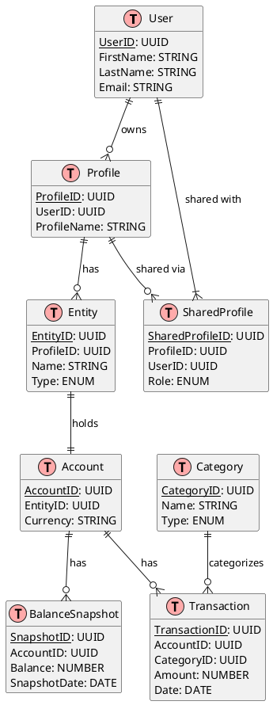

# Entities

## Summary
This document provides an overview of the core entities, their attributes, and how they relate to each other within the application. It includes an entity-relationship diagram illustrating these connections and offers guidance on the database schema and potential migration paths.

## Entities and Attributes

### **1. `User`**  
| Attribute          | Type        | Description                                   | Constraints       |  
|--------------------|-------------|-----------------------------------------------|-------------------|  
| `UserID`           | UUID        | Unique identifier for the user.               | Primary Key       |  
| `FirstName`        | VARCHAR(50) | User’s first name.                            | Not Null          |  
| `LastName`         | VARCHAR(50) | User’s last name.                             | Not Null          |  
| `Email`            | VARCHAR(100)| User’s email address (used for login).        | Unique, Not Null  |

### **2. `Profile`**  
| Attribute          | Type        | Description                                   | Constraints       |  
|--------------------|-------------|-----------------------------------------------|-------------------|  
| `ProfileID`        | UUID        | Unique identifier for the profile.            | Primary Key       |  
| `UserID`           | UUID        | Owner of the profile.                         | Foreign Key (`User.UserID`) |  
| `ProfileName`      | VARCHAR(50) | Name of the profile (e.g., "Family Budget").  | Not Null          |  

### **3. `SharedProfile`**  
| Attribute          | Type        | Description                                   | Constraints       |  
|--------------------|-------------|-----------------------------------------------|-------------------|  
| `SharedProfileID`  | UUID        | Unique identifier for the shared access.      | Primary Key       |  
| `ProfileID`        | UUID        | Profile being shared.                         | Foreign Key (`Profile.ProfileID`) |  
| `UserID`           | UUID        | User with whom the profile is shared.         | Foreign Key (`User.UserID`) |  
| `Role`             | ENUM        | `VIEWER`, `EDITOR`.                           | Not Null          |  

### **4. `Entity`**  
| Attribute          | Type        | Description                                   | Constraints       |  
|--------------------|-------------|-----------------------------------------------|-------------------|  
| `EntityID`         | UUID        | Unique identifier for the entity.             | Primary Key       |  
| `ProfileID`        | UUID        | Profile owning the entity.                    | Foreign Key (`Profile.ProfileID`) |  
| `Name`             | VARCHAR(100)| Name of the entity (e.g., "Bank X").          | Not Null          |  
| `Type`             | ENUM        | `BANK`, `STOCK_BROKER`, `CASH`.               | Not Null          |  

### **5. `Account`**  
| Attribute          | Type        | Description                                   | Constraints       |  
|--------------------|-------------|-----------------------------------------------|-------------------|  
| `AccountID`        | UUID        | Unique identifier for the account.            | Primary Key       |  
| `EntityID`         | UUID        | Linked financial entity.                      | Foreign Key (`Entity.EntityID`) |  
| `Currency`         | CHAR(3)     | Currency code (e.g., EUR).                    | Not Null          |  

### **6. `BalanceSnapshot`**  
| Attribute          | Type         | Description                                   | Constraints       |  
|--------------------|--------------|-----------------------------------------------|-------------------|  
| `SnapshotID`       | UUID         | Unique identifier for the snapshot.           | Primary Key       |  
| `AccountID`        | UUID         | Account linked to the snapshot.               | Foreign Key (`Account.AccountID`) |  
| `Balance`          | DECIMAL(15,2)| Account balance.                              | Not Null          |  
| `SnapshotDate`     | DATE         | Date of the snapshot.                         | Not Null          |  

### **7. `Transaction`**  
| Attribute          | Type         | Description                                   | Constraints       |  
|--------------------|--------------|-----------------------------------------------|-------------------|  
| `TransactionID`    | UUID         | Unique identifier for the transaction.        | Primary Key       |  
| `AccountID`        | UUID         | Account linked to the transaction.            | Foreign Key (`Account.AccountID`) |  
| `CategoryID`       | UUID         | Transaction category.                         | Foreign Key (`Category.CategoryID`) |  
| `Amount`           | DECIMAL(15,2)| Transaction amount (±).                       | Not Null          |  
| `Date`             | DATE         | Date of the transaction.                      | Not Null          |  

### **8. `Category`**  
| Attribute          | Type        | Description                                   | Constraints       |  
|--------------------|-------------|-----------------------------------------------|-------------------|  
| `CategoryID`       | UUID        | Unique identifier for the category.           | Primary Key       |  
| `Name`             | VARCHAR(50) | Category name (e.g., "Groceries").            | Unique, Not Null  |  
| `Type`             | ENUM        | `INCOME`, `EXPENSE`, `INVESTMENT`.            | Not Null          |  

---

## **Entity-Relationship Diagram (ERD)**  

---

## Database Schema
Include database schema proposals and migration scripts.
