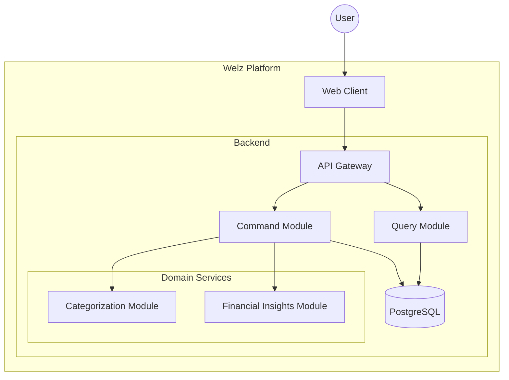
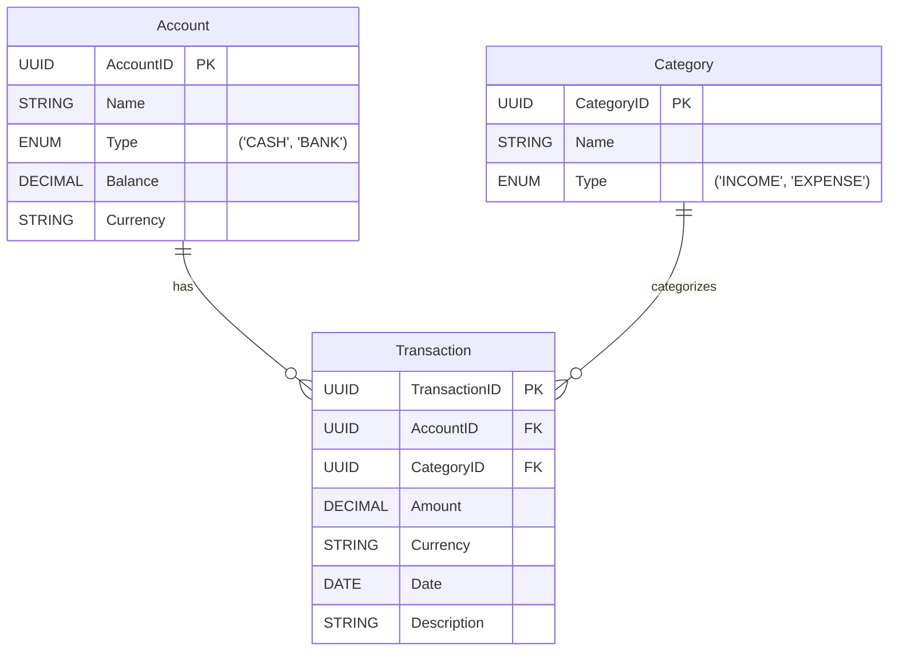

## Índice

0. [Ficha del proyecto](#0-ficha-del-proyecto)
1. [Descripción general del producto](#1-descripción-general-del-producto)
2. [Arquitectura del sistema](#2-arquitectura-del-sistema)
3. [Modelo de datos](#3-modelo-de-datos)
4. [Especificación de la API](#4-especificación-de-la-api)
5. [Historias de usuario](#5-historias-de-usuario)
6. [Tickets de trabajo](#6-tickets-de-trabajo)
7. [Pull requests](#7-pull-requests)

---

## 0. Ficha del proyecto

### **0.1. Tu nombre completo:**

Oscar Guillén Mateu

### **0.2. Nombre del proyecto:**

Welz

### **0.3. Descripción breve del proyecto:**

**Welz** es una plataforma integral de finanzas personales diseñada para ofrecer una visión completa del estado financiero de sus usuarios, tanto en el entorno digital como en el físico. La aplicación integra diversas APIs bancarias y permite sincronizar cuentas, clasificar transacciones de manera inteligente y generar insights financieros en tiempo real.

### **0.4. URL del proyecto:**

> Puede ser pública o privada, en cuyo caso deberás compartir los accesos de manera segura. Puedes enviarlos a [alvaro@lidr.co](mailto:alvaro@lidr.co) usando algún servicio como [onetimesecret](https://onetimesecret.com/).

### 0.5. URL o archivo comprimido del repositorio

> Puedes tenerlo alojado en público o en privado, en cuyo caso deberás compartir los accesos de manera segura. Puedes enviarlos a [alvaro@lidr.co](mailto:alvaro@lidr.co) usando algún servicio como [onetimesecret](https://onetimesecret.com/). También puedes compartir por correo un archivo zip con el contenido

https://github.com/Osguima3/welz

---

## 1. Descripción general del producto

### **1.1. Objetivo:**
Welz busca proporcionar una solución integral para la gestión de finanzas personales,
abarcando tanto cuentas bancarias como el uso de dinero en efectivo. El objetivo es
ofrecer una vista completa y en tiempo real del patrimonio neto, así como un análisis
inteligente de gastos e ingresos para impulsar mejores decisiones financieras de sus usuarios.

### **1.2. Características y funcionalidades principales:**
- Integración de cuentas bancarias y de inversión a través de APIs y Open Banking.
- Registro y seguimiento de transacciones en efectivo, permitiendo una imagen
  financiera más completa.
- Automatización en la categorización de transacciones mediante IA, con la opción
  de refinar manualmente.
- Gestión de presupuestos y objetivos compartidos para individuos y familias.
- Panel de control con métricas de net worth, seguimiento de gastos, y alertas de
  sobrepaso de límites o anomalías financieras.

### **1.3. Diseño y experiencia de usuario:**

> Proporciona imágenes y/o videotutorial mostrando la experiencia del usuario desde que aterriza en la aplicación, pasando por todas las funcionalidades principales.

### **1.4. Instrucciones de instalación:**
> Documenta de manera precisa las instrucciones para instalar y poner en marcha el proyecto en local (librerías, backend, frontend, servidor, base de datos, migraciones y semillas de datos, etc.)

**Instalación**
```bash
# Instalar dependencias de Deno
deno cache deps.ts
```

**Configuración de Base de Datos**
```bash
# Iniciar contenedor PostgreSQL
docker compose up db -d

# Crear base de datos
docker compose exec db createdb -U postgres welz

# Ejecutar migraciones usando Nessie
deno task nessie migrate

# Cargar datos iniciales
deno task nessie seed
```

**Iniciar Servicios**
```bash
# Iniciar backend y frontend
deno task dev

# Ejecutar pruebas
deno task test
```

---

## 2. Arquitectura del Sistema

### **2.1. Diagrama de arquitectura:**
> Usa el formato que consideres más adecuado para representar los componentes principales de la aplicación y las tecnologías utilizadas. Explica si sigue algún patrón predefinido, justifica por qué se ha elegido esta arquitectura, y destaca los beneficios principales que aportan al proyecto y justifican su uso, así como sacrificios o déficits que implica.

La aplicación utiliza Deno Fresh, un framework para Typescript que gestiona tanto backend como frontend.

El backend se basa en CQRS (Command Query Responsibility Segregation), que separa las operaciones de lectura y escritura mediante módulos especializados, mejorando el rendimiento, la escalabilidad y mantenibilidad del sistema. La implementación se hace mediante EffectTS.

El frontend utiliza el sistema de "islas" de Fresh, basado en renderizado en servidor (SSR). Los componentes de la UI se gestionan mediante "islas" que cargan el contenido a medida que el frontend las pide de forma *lazy*. Otras librerías usadas son EffectTS, Preact y Tailwind para el CSS.

La base de datos es un PostgreSQL, que almacena tanto los datos puros, como vistas materializadas que sirven de "Read Models" para el sistema CQRS, a modo de caché de lectura. La librería Nessie de deno se usa para ejecutar las migraciones.

El sistema también incluye un bus de eventos en memoria que permite la comunicación entre módulos.



### **2.2. Descripción de componentes principales:**

> Describe los componentes más importantes, incluyendo la tecnología utilizada

**API Gateway**
- Punto único de entrada para todas las peticiones de la API
- Gestiona el enrutamiento y validación de peticiones
- Administra el versionado y documentación de la API
- Enruta peticiones a los módulos de Command o Query según el tipo de operación

**Command Module**
- Procesa operaciones de escritura
- Aplica reglas de dominio y mantiene la consistencia de datos
- Persiste cambios directamente en PostgreSQL

**Query Module**
- Maneja todas las operaciones de lectura
- Implementa estrategias de caché
- Se suscribe a eventos relevantes para refrescar las vistas

**Categorization Module**
- Categoriza transacciones basándose en reglas simples
- Permite al usuario cambiar categorías

**Financial Insights Module**
- Calcula patrimonio neto en tiempo real basado en activos y pasivos
- Genera informes financieros
- Almacena métricas financieras en la Base de Datos

**Database**
- PostgreSQL para almacenamiento de datos relacionales
- Asegura acceso eficiente y estructurado a los datos


### **2.3. Descripción de alto nivel del proyecto y estructura de ficheros**

> Representa la estructura del proyecto y explica brevemente el propósito de las carpetas principales, así como si obedece a algún patrón o arquitectura específica.

La aplicación está basada en Deno, un framework para Typescript que gestiona tanto frontend como backend.

El backend está basada en el patrón DDD (Domain-Driven Design), que separa las capas de dominio, orquestación y infraestructura y marca la estructura en carpetas. CQRS se suele implementar juntamente a Event Sourcing, pero para limitar el scope del proyecto se ha excluido este último.

El frontend utiliza Deno Fresh, basado en renderizado en servidor (SSR). Los componentes de la UI se gestionan mediante "islas" que cargan el contenido a medida que el frontend las pide de forma *lazy*, y la estructura de carpetas sigue la forma por defecto para este framework.

La base de datos usada es un PostgreSQL, gestionada con Nessie, una librería de migraciones nativa para Deno, con dos carpetas, una para el esquema de la base de datos, y otra para hidratar los datos iniciales.

Finalmente, hay multiples otras carpetas que contienen ficheros adicionales, como la documentación, o la configuración de la infraestructura en contenedores de docker.

```
/
├── apps/                       # Código de la aplicación
│   ├── backend/                # Monolito del backend
│   │   ├── src/
│   │   │   ├── domain/         # Modelo de dominio y agregados
│   │   │   ├── application/    # Servicios de aplicación
│   │   │   ├── infrastructure/ # Implementaciones técnicas
│   │   │   └── shared/         # Utilidades compartidas
│   │   ├── db/                 # Gestión de base de datos
│   │   │   ├── migrations/     # Migraciones Nessie
│   │   │   └── seeds/          # Datos iniciales
│   │   └── tests/              # Suites de pruebas
│   │
│   └── web/                    # Aplicación frontend
│       ├── routes/             # Rutas de Fresh
│       ├── islands/            # Componentes interactivos
│       └── components/         # Componentes de UI
│
├── packages/                   # Código compartido
│   ├── types/                  # Definiciones de tipos
│   ├── validation/             # Reglas de validación
│   └── utils/                  # Utilidades compartidas
│
├── tools/                      # Herramientas de desarrollo
│   └── scripts/                # Scripts de construcción y mantenimiento
│
├── docs/                       # Documentación
│   ├── model/                  # Documentación del dominio
│   └── api/                    # Documentación de la API
│
└── infra/                      # Infraestructura
  └── docker/                   # Configuraciones de Docker
```

### **2.4. Infraestructura y despliegue**

> Detalla la infraestructura del proyecto, incluyendo un diagrama en el formato que creas conveniente, y explica el proceso de despliegue que se sigue

### **2.5. Seguridad**

> Enumera y describe las prácticas de seguridad principales que se han implementado en el proyecto, añadiendo ejemplos si procede

El sistema, al gestionar datos financieros, requerirá seguir las directrices de GDPR y de PSD2, aunque por scope, la implementación a nivel de seguridad será mínima. El MVP solo contará con un usuario de demo (la base de datos no gestionará usuarios) y no habrá autenticación.

### **2.6. Tests**

> Describe brevemente algunos de los tests realizados

---

## 3. Modelo de Datos

### **3.1. Diagrama del modelo de datos:**

> Recomendamos usar mermaid para el modelo de datos, y utilizar todos los parámetros que permite la sintaxis para dar el máximo detalle, por ejemplo las claves primarias y foráneas.



### **3.2. Descripción de entidades principales:**

> Recuerda incluir el máximo detalle de cada entidad, como el nombre y tipo de cada atributo, descripción breve si procede, claves primarias y foráneas, relaciones y tipo de relación, restricciones (unique, not null…), etc.

### accounts
Fuente única de verdad para todas las cuentas financieras y sus saldos actuales.

| Columna | Tipo | Descripción | Restricciones |
|--------|------|-------------|-------------|
| id | UUID | Identificador único de cuenta | PRIMARY KEY |
| name | VARCHAR(255) | Nombre de cuenta definido por usuario para mostrar | NOT NULL |
| type | VARCHAR(20) | Clasificación de cuenta (CASH/BANK) | CHECK (type IN ('CASH', 'BANK')) |
| balance | DECIMAL(19,4) | Saldo monetario actual | NOT NULL, DEFAULT 0 |
| currency | CHAR(3) | Código de moneda ISO 4217 | NOT NULL |
| created_at | TIMESTAMPTZ | Marca de tiempo de creación de cuenta | NOT NULL, DEFAULT CURRENT_TIMESTAMP |
| updated_at | TIMESTAMPTZ | Marca de tiempo de última actualización del saldo | NOT NULL, DEFAULT CURRENT_TIMESTAMP |

### transactions
Almacena todas las transacciones financieras.

| Columna | Tipo | Descripción | Restricciones |
|--------|------|-------------|-------------|
| id | UUID | Identificador único | PRIMARY KEY |
| account_id | UUID | Referencia a cuenta origen | FOREIGN KEY (accounts), NOT NULL |
| amount | DECIMAL(19,4) | Monto de la transacción | NOT NULL |
| currency | CHAR(3) | Código de moneda ISO | NOT NULL |
| date | DATE | Fecha de la transacción | NOT NULL |
| description | TEXT | Descripción de la transacción | NOT NULL |
| category_id | UUID | Referencia a categoría | FOREIGN KEY (categories) |
| created_at | TIMESTAMPTZ | Marca de tiempo de creación | NOT NULL, DEFAULT CURRENT_TIMESTAMP |
| updated_at | TIMESTAMPTZ | Marca de tiempo de última actualización | NOT NULL, DEFAULT CURRENT_TIMESTAMP |

### categories
Define el sistema de categorización de transacciones.

| Columna | Tipo | Descripción | Restricciones |
|--------|------|-------------|-------------|
| id | UUID | Identificador único | PRIMARY KEY |
| name | VARCHAR(100) | Nombre de la categoría | NOT NULL, UNIQUE |
| type | VARCHAR(20) | 'INCOME' o 'EXPENSE' | CHECK (type IN ('INCOME', 'EXPENSE')) |
| created_at | TIMESTAMPTZ | Marca de tiempo de creación | NOT NULL, DEFAULT CURRENT_TIMESTAMP |

---

## 4. Especificación de la API

> Si tu backend se comunica a través de API, describe los endpoints principales (máximo 3) en formato OpenAPI. Opcionalmente puedes añadir un ejemplo de petición y de respuesta para mayor claridad

---

## 5. Historias de Usuario

> Documenta 3 de las historias de usuario principales utilizadas durante el desarrollo, teniendo en cuenta las buenas prácticas de producto al respecto.

### Historia de Usuario 1

**Como usuario, quiero ver datos simulados de cuentas financieras para probar la vista consolidada**

#### Descripción:  
Mostrar datos simulados preconfigurados que representen cuentas bancarias y transacciones para demostrar la funcionalidad del panel de control.  

#### Criterios de Aceptación:  
• El panel muestra cuentas bancarias simuladas con saldos  
• El listado de transacciones muestra datos de ejemplo  
• Indicación clara de que los datos son solo para demostración

### Historia de Usuario 2

**Como usuario, quiero una gestión básica de transacciones para llevar un seguimiento de mis gastos**

#### Descripción:
Permitir la entrada manual de transacciones con operaciones CRUD básicas.

#### Criterios de Aceptación:
- Formulario básico para ingresar transacciones (monto, fecha, categoría)
- Vista de lista de transacciones ingresadas
- Capacidades de edición y eliminación

### Historia de Usuario 3

**Como usuario, quiero ver información básica sobre mis gastos para poder entender mejor mis finanzas**

**Descripción:**  
Muestra estadísticas simples basadas en los datos de transacciones, como el desglose de gastos por categoría y tendencias básicas.

**Criterios de Aceptación:**
- Desglose de gastos por categoría
- Tendencias de gastos mensuales
- Principales categorías de gasto

---

## 6. Tickets de Trabajo

> Documenta 3 de los tickets de trabajo principales del desarrollo, uno de backend, uno de frontend, y uno de bases de datos. Da todo el detalle requerido para desarrollar la tarea de inicio a fin teniendo en cuenta las buenas prácticas al respecto. 

### Ticket 1

**[WELZ-009][Backend] Implementar endpoints básicos de analíticas**  

#### Descripción
Crear endpoints para información y estadísticas básicas de gastos.

#### Detalles
- Implementar agregaciones basadas en categorías  
- Crear cálculos de tendencias mensuales  
- Agregar endpoints estadísticos básicos  

#### Criterios de Aceptación
- Los endpoints devuelven datos agregados correctos  
- El rendimiento es aceptable para grandes conjuntos de datos  
- Los datos se almacenan en caché adecuadamente  

**Esfuerzo:** M  
**Prioridad:** Media  
**Dependencias:** WELZ-006

### Ticket 2

**[WELZ-005][Frontend] Implementar diseño y componentes del panel de control**

#### Descripción  
Crear el diseño principal del panel de control y los componentes necesarios para mostrar datos financieros.

#### Detalles  
• Crear diseño reutilizable para el panel de control  
• Implementar componente de resumen de cuentas  
• Implementar componente de lista de transacciones  

#### Criterios de Aceptación  
• El panel muestra saldos de cuentas simuladas  
• La lista de transacciones se muestra con datos paginados  
• Los componentes son responsivos  

**Esfuerzo:** M  
**Prioridad:** Alta  
**Dependencias:** WELZ-004

### Ticket 3

**[WELZ-004][Backend] Crear estructura de datos simulados y entidades estáticas**  

#### Descripción  
Definir e implementar la estructura de datos para información financiera simulada con dos entidades estáticas (Efectivo y Banco).

#### Detalles  
- Diseñar el esquema de base de datos para cuentas y transacciones  
- Crear migraciones de base de datos  
- Implementar datos de ejemplo para entidades estáticas  
- Agregar datos simulados de transacciones  

#### Criterios de Aceptación  
- El esquema de base de datos admite los datos necesarios  
- Las entidades estáticas se crean durante la configuración  
- Los datos simulados reflejan escenarios reales  

**Esfuerzo:** S  
**Prioridad:** Alta  
**Dependencias:** WELZ-003

---

## 7. Pull Requests

> Documenta 3 de las Pull Requests realizadas durante la ejecución del proyecto

**Pull Request 1**

https://github.com/Osguima3/welz/pull/1

Añadidos PRD y documento de arquitectura, incluyendo patrones de desarrollo, descripciones de los componentes, diagramas C4, estructura de carpetas del proyecto e instrucciones para arrancar backend, frontend y base de datos. 

**Pull Request 2**

https://github.com/Osguima3/welz/pull/2

- Añadida estructura base del proyecto, tanto de backend como de frontend.
- Framework de testing listo para usar.
- Preparado setup de docker para levantar la base de datos.
- Añadido endpoint simple para comprobar todo que todo el flujo funciona.

**Pull Request 3**

https://github.com/Osguima3/welz/pull/3

- Añadidas todas las pantallas del frontend, incluyendo dashboard, transacciones de cuenta y de categorías.
- Añadida lógica de las queries avanzadas de análisis de transacciones
- Preparado el setup para hacer deploy en producción.